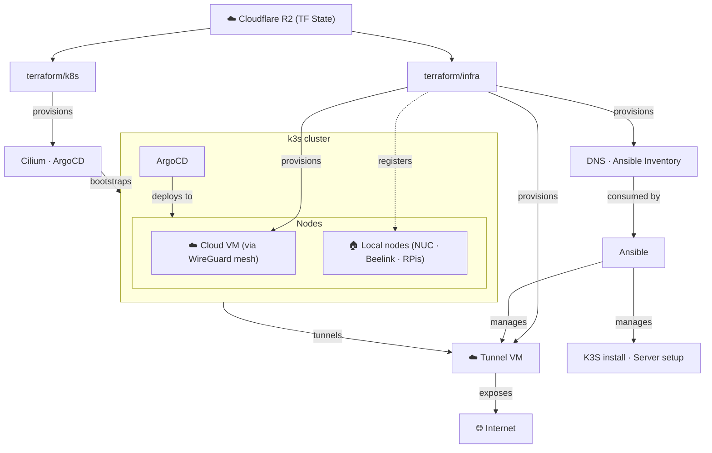

# Homelab Cluster

My homelab K3s cluster configuration

## Hardware

| Device                | Count | RAM   | Disks                                                                | OS              | Arch  |
| --------------------- | ----- | ----- | -------------------------------------------------------------------- | --------------- | ----- |
| Intel NUC I7 10th Gen | 1     | 40GB  | SSD 4TB (X2) <br> SSD 2TB (X2) <br> Micro SD 1TB (X2) <br> USB 512GB | TrueNAS SCALE   | amd64 |
| Intel NUC I7 10th Gen | 1     | 32GB  | SSD 256GB                                                            | Ubuntu 24.04    | amd64 |
| Beelink SER5          | 1     | 40 GB | SSD 512GB                                                            | Ubuntu 24.04    | amd64 |
| Raspberry Pi 4        | 2     | 8 GB  | SD 32GB                                                              | Raspberry PI OS | armv7 |
| Raspberry Pi 4        | 1     | 4 GB  | SD 32GB                                                              | Raspberry PI OS | armv7 |

## Repository structure

```sh
├── ansible       # Management of cluster and non cluster instances
│   ├── inventory # Dynamic inventory, generated by terraform
│   ├── playbooks # Usual Ansible playbooks 
│   ├── roles     # Reusable Ansible roles
├── k8s           # Kubernetes cluster configuration / resources
│   ├── apps      # Apps of apps definitions
│   ├── charts    # Local helm charts
│   ├── system    # System apps definitions
│   ├── values    # Helm values files
│   └── workloads # Kubernetes workloads definitions
└── terraform     # Resource provisioning
    ├── infra     # Infrastructure provisioning (Cloudflare DNS, Hetzner, etc.)
    └── k8s       # Critical cluster provisioning (config, cilium, argocd, etc.)
```

## Architecture



## Credits to:
- [K3S](https://k3s.io) by [Rancher](https://rancher.com/)
- [Tailscale](https://github.com/tailscale/tailscale) by [Tailscale](https://tailscale.com/)
- [Terraform](https://www.terraform.io) by [HashiCorp](https://www.hashicorp.com/)
- [Ansible](https://www.ansible.com) by [RedHat](https://www.redhat.com/)
- [Argocd](https://argoproj.github.io/cd/) by [Argo Project](https://github.com/argoproj)
